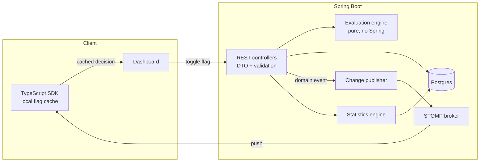

# feat: Complete REX Platform

## Overview

REX Platform is a real-time feature flag and experimentation service abandoned in August 2025
after a single day of work. Roughly 3,600 lines of Java exist across entities, repositories and
services, but nothing is reachable: there is no HTTP surface, no real-time transport despite
"real-time" being in the name, no tests, no CI, and no statistics despite the domain model
already carrying `confidenceLevel` and `minimumSampleSize`.

This plan completes it as six phases, each ending in something demonstrable. The finished system
lets an operator toggle a flag or start an experiment in a dashboard, propagates that change to
connected SDK clients over WebSocket in under a second, deterministically buckets users into
variants by percentage or by attribute-based targeting rules, and reports whether an experiment's
result is statistically significant rather than merely different.

Beyond that it runs rollouts on its own. A flag can advance through staged percentages on a
schedule while guardrail metrics watch the exposed cohort, and a breach halts the rollout and
reverts to the last safe percentage without anyone intervening. Every change, human or automated,
lands in an append-only audit trail.

## Problem Frame

Feature flag services are a crowded category, so a portfolio version earns attention only by
being correct where clones are careless. Three areas carry that weight here:

1. **Bucketing correctness.** Assignment must be deterministic, uniformly distributed, and
   stable across restarts and redeploys. The current implementation is none of these.
2. **Real propagation.** "Real-time" must mean pushed, measured, and demonstrable, not polled.
3. **Statistical honesty.** Reporting a lift without a significance test, a confidence interval,
   and a sample-size gate is the single most common flaw in experimentation demos.
4. **Autonomy.** A flag platform that only stores flags is a database with opinions. Advancing a
   rollout on a schedule and reverting it when guardrails breach is the part that earns the word
   platform.

Everything else is competent plumbing and should be built to a professional standard without
consuming the schedule.

## Requirements Trace

- **R1.** Fix the bucketing defect and prove correctness with distribution and stability tests.
- **R2.** Expose a versioned, validated, documented REST API returning a consistent error contract.
- **R3.** Push flag and experiment changes to connected clients over WebSocket, never polling.
- **R4.** Ship a client SDK that maintains a local cache updated by push, with measured propagation latency.
- **R5.** Compute statistical significance, confidence intervals, and sample-size gating.
- **R6.** Enforce quality gates in CI on every push: format, static analysis, null safety, architecture, coverage.
- **R7.** Provide a responsive dashboard supporting dark and light themes, decoupled from the backend via environment configuration.
- **R8.** Keep secrets out of source, in `.env` with a committed `.env.example`.
- **R9.** Deploy the service and dashboard to reachable URLs.
- **R10.** Support attribute-based targeting rules beyond percentage rollout.
- **R11.** Automate progressive rollout with guardrail metrics and automatic rollback.
- **R12.** Record an immutable audit trail of every configuration change.

## Scope Boundaries

Explicit non-goals. Each is a defensible omission rather than an oversight, and the README
should say so.

- **No authentication or multi-tenancy.** A demo operator console, not a hosted SaaS. Adding
  auth would consume a phase and demonstrate nothing the rest of the portfolio lacks.
- **No horizontal scale-out.** Single-instance deployment only, which constrains two things
  rather than one. The WebSocket layer broadcasts in-process, and the rollout scheduler assumes a
  single `@Scheduled` runner. On multiple instances the broker would need a Redis relay and the
  scheduler would need distributed locking such as ShedLock, or every instance would advance the
  same rollout stage concurrently. Both are documented in the README as the known scale path and
  neither is built.
- **No streaming ingestion.** Metrics are written synchronously through JPA. Kafka would be
  architecture theatre at this data volume.
- **No bandit or multi-armed optimisation.** Fixed-horizon frequentist testing only, honestly
  labelled as such.
- **No mobile or server SDK matrix.** One reference SDK in TypeScript, which is what the
  dashboard itself consumes.

### Deferred to Separate Tasks

- Redis-backed WebSocket relay for multi-instance deployment: future iteration, noted in the
  architecture section of the README.
- Bayesian analysis alongside the frequentist path: future iteration.

## Context and Research

### Relevant Code and Patterns

- `src/main/java/com/rex/model/FeatureFlag.java`: flag entity with `enabled`, `status`,
  `environment`, `rolloutPercentage`. Sound shape, keep as the persistence model.
- `src/main/java/com/rex/model/Experiment.java`: already carries `hypothesis`,
  `successMetric`, `confidenceLevel`, `minimumSampleSize`, `currentSampleSize`,
  `trafficPercentage`. The statistical phase consumes these rather than adding fields.
- `src/main/java/com/rex/model/UserCohort.java`: sticky assignment record with
  `assignmentMethod`, `assignmentHash`, `exposureCount`. The evaluation engine writes here.
- `src/main/java/com/rex/service/ExperimentService.java`: contains the bucketing defect at the
  `calculateUserHash` and percentage helpers.
- `src/main/java/com/rex/service/MetricsService.java`: aggregation surface
  (`getExperimentPerformanceSummary`, `getConversionFunnel`) that the statistics engine reads from.
- `src/main/resources/data.sql`: seeds one row per table. Extend into a demo dataset large
  enough that the dashboard shows a meaningful experiment on first load.

### Known Defects

- **Bucketing.** `Math.abs(userId.hashCode()) % 100` in `ExperimentService`. Two faults:
  `String.hashCode` has poor avalanche behaviour so adjacent user IDs land in adjacent buckets,
  and `Math.abs(Integer.MIN_VALUE)` returns `Integer.MIN_VALUE`, which is negative, so a single
  unlucky user ID produces a negative bucket index.
- **Hardcoded credential.** `spring.datasource.password=rex_password` sits in
  `application.properties`, contradicting the standing rule that secrets live only in `.env`.
- **Schema volatility.** `spring.jpa.hibernate.ddl-auto=create-drop` is acceptable for a scratch
  H2 database and unacceptable once Postgres is the target. Flyway replaces it in Phase 0.

### External References

- Spring Boot 3.4 supports RFC 7807 Problem Details natively via
  `ProblemDetail` and `spring.mvc.problemdetails.enabled`. Use it rather than a bespoke error shape.
- Wilson score interval is preferred over the normal approximation for conversion-rate bounds at
  small sample sizes, where the naive interval can extend below zero.
- Testcontainers is the standard approach for integration tests against a real Postgres rather
  than a dialect-emulating H2.

## Key Technical Decisions

- **Colima as the container runtime locally, never Docker Desktop.** The machine already runs
  Colima 0.9.1 with the Homebrew `docker` CLI and Compose v5, and Docker Desktop is not installed.
  Testcontainers does not always resolve a Colima socket on its own, so the repository commits the
  two environment variables it needs rather than leaving each developer to rediscover them:
  `DOCKER_HOST` pointing at the Colima socket, and `TESTCONTAINERS_DOCKER_SOCKET_OVERRIDE` set to
  `/var/run/docker.sock` so the Ryuk reaper container mounts the path it expects inside the VM.
  Verified before planning closed: `postgres:16-alpine` reaches ready in about three seconds on
  this profile (4 CPU, 6 GiB).
- **Postgres in production and integration tests, H2 nowhere.** H2 in MySQL compatibility mode
  hides dialect bugs. Testcontainers gives a real Postgres per test run. Removing H2 also removes
  the `create-drop` schema strategy.
- **Flyway for schema.** Versioned migrations replace Hibernate auto-DDL. `ddl-auto=validate` in
  every profile so a drift between entity and schema fails startup rather than silently rewriting.
- **MurmurHash3 (32-bit) for bucketing.** Fast, well-distributed, and the de facto choice in this
  domain, so the behaviour matches what a reviewer expects. Bucket on `experimentKey:userId` so
  the same user lands differently in different experiments and correlated assignment is avoided.
- **STOMP over WebSocket with SockJS fallback.** Spring's `spring-boot-starter-websocket` gives a
  broker relay and subscription semantics without hand-rolling frame handling.
- **Evaluation engine as a pure component.** `FlagEvaluator` and `VariantAssigner` take inputs and
  return decisions with no repository or Spring dependency. This is what makes the correctness
  properties testable and is the same separation that made `logic/` testable in `suicide_squad`.
- **DTOs at the boundary.** Controllers never serialise JPA entities. Prevents lazy-loading leaks
  and accidental schema exposure through the API.
- **Frontend as a separate Next.js app.** Next.js 16 with the App Router and React 19, configured
  by `NEXT_PUBLIC_API_URL` and `NEXT_PUBLIC_WS_URL`, deployed independently to Vercel. Satisfies the
  decoupling rule and makes the SDK dogfood itself, since the dashboard consumes the same SDK an
  external client would.
- **Server components fetch the initial flag state, client components own the live updates.** This
  is a real use of server rendering rather than decoration: the first paint carries real flag data
  from the server, then the socket takes over for every subsequent change. The alternative, a
  client-only app, shows an empty table until the first fetch resolves.
- **The SDK stays framework-agnostic.** It ships as plain TypeScript with no React dependency, so
  it works in a plain browser page, a Node service, or any framework. The dashboard wraps it in a
  React hook rather than the SDK knowing React exists.
- **Quality gates mirror the Python toolchain used in `Slackops`, translated per language.**
  Java: Error Prone with NullAway in place of `mypy --strict`, Spotless and Checkstyle in place of
  `ruff`, JUnit 5 with AssertJ in place of `pytest`, JaCoCo for coverage. TypeScript: `tsc --strict`
  with `noUncheckedIndexedAccess`, ESLint, and Vitest. One CI workflow runs both halves, and a
  failure in either fails the build.
- **NullAway as the strict-typing substitute.** Java has no `mypy --strict` equivalent. NullAway
  over package-level `@NullMarked` annotations is the closest practical option and fails the build
  on a possible null dereference rather than deferring it to runtime.
- **ArchUnit for layering.** A test asserting that controllers never touch repositories directly,
  and that the evaluation engine imports nothing from Spring, keeps the architecture honest as it
  grows.

## Open Questions

### Resolved During Planning

- *Keep Thymeleaf or build a separate frontend?* Separate frontend. Thymeleaf is removed from the
  POM. The decoupling rule applies, and the dashboard consuming the published SDK is a stronger
  demonstration than server-rendered templates.
- *H2 or Postgres?* Postgres everywhere. See decisions above.
- *Which statistical test?* Two-proportion z-test for conversion-rate experiments, with a Wilson
  interval on each variant and on the difference. Welch's t-test is deferred because the seeded
  success metrics are all binary conversions.
- *Should the SDK be Java or TypeScript?* TypeScript, because the dashboard can then consume it,
  which proves the SDK works rather than asserting it.

### Deferred to Implementation

- Exact Flyway baseline shape once entities are reconciled against a real Postgres. The entity
  definitions are the source of truth; the first migration is generated from them and then frozen.
- Whether `MetricsService` aggregation queries need indexes beyond the obvious foreign keys.
  Decide after seeding a realistic dataset and reading query plans, not before.
- Final WebSocket topic naming. The shape is `/topic/flags/{environment}` and
  `/topic/experiments/{environment}`, but subscription granularity may need adjusting once the SDK
  cache is written.

## High-Level Technical Design

> *This illustrates the intended approach and is directional guidance for review, not
> implementation specification. The implementing agent should treat it as context, not code to
> reproduce.*



The evaluation path and the propagation path are deliberately separate. A flag decision never
waits on the broker, and a broker failure degrades clients to their last known cache rather than
breaking evaluation.

**Bucketing contract**, the property the tests must prove:

```text
assign(experimentKey, userId) is
  deterministic  : same inputs always yield the same variant
  independent    : a user's bucket in experiment A tells you nothing about experiment B
  uniform        : over N users, each percentage bucket receives ~N/100, chi-square within tolerance
  stable         : adding a new experiment never reshuffles an existing one
```

## Implementation Units

### Phase 0: Foundation, Quality Gates, CI

- [x] **Unit 0.1: Replace H2 with Postgres and Flyway**

**Goal:** A real database, versioned schema, and no auto-DDL.

**Requirements:** R8

**Dependencies:** None

**Files:**
- Modify: `pom.xml`, `src/main/resources/application.properties`
- Create: `src/main/resources/application-local.properties`, `src/main/resources/db/migration/V1__baseline_schema.sql`, `src/main/resources/db/migration/V2__reference_seed.sql`, `.env.example`, `docker-compose.yml`
- Delete: `src/main/resources/data.sql`
- Delete: H2 dependency and console configuration

**Approach:**
- Generate the baseline migration from the current entities, then set `ddl-auto=validate` so
  entity and schema drift fails startup.
- **Delete `src/main/resources/data.sql`.** Spring's `data.sql` mechanism is ordered against
  Hibernate DDL, not Flyway, so keeping it alongside migrations produces a startup race. Its
  contents move into `V2__reference_seed.sql`, and the larger demo dataset arrives later as `V6`.
- Migration numbering is reserved up front so phases cannot collide: V1 baseline, V2 reference
  seed, V3 exposure decision columns, V4 targeting rules, V5 rollout schedules, V6 audit log,
  V7 demo seed. (V3 was assigned during Phase 1; everything after it shifted up by one.)
- Datasource credentials read from environment with no defaults committed.
- **Spring Boot does not read `.env` files natively.** Docker Compose loads `.env` automatically
  for containerised runs, and local `./mvnw spring-boot:run` uses the `spring-dotenv` dependency so
  both paths resolve the same variables. Without this the rule that secrets live only in `.env`
  cannot actually be satisfied for local development.
- `docker-compose.yml` provides Postgres for local development, started with `colima start`
  followed by `docker compose up`. No Docker Desktop anywhere in the workflow.
- A `.env.example` entry documents the Colima socket path, and the README records the two
  Testcontainers variables so a fresh clone does not fail with an unhelpful socket error.

**Test scenarios:**
- Integration: application context starts against a Testcontainers Postgres with `ddl-auto=validate`, proving the migration matches the entities.
- Note: a single shared container instance is reused across the integration suite. Starting a
  container per test class would make the suite slow enough that people stop running it locally.
- Error path: startup fails with a clear message when `DB_PASSWORD` is absent rather than falling back to a default.

**Verification:** `docker compose up` then a clean application start with no schema warnings.

- [x] **Unit 0.2: Quality gate toolchain**

**Goal:** The build fails on formatting, static analysis, null safety, or coverage regressions.

**Requirements:** R6

**Dependencies:** Unit 0.1

**Files:**
- Modify: `pom.xml`
- Create: `config/checkstyle.xml`, `config/spotbugs-exclude.xml`, `src/test/java/com/rex/architecture/LayeringRulesTest.java`, `package-info.java` per package for null annotations

**Approach:**
- Spotless with google-java-format, Checkstyle, SpotBugs, Error Prone with NullAway, and JaCoCo.
- **Coverage floor starts at 70 percent line and 60 percent branch**, which the existing service
  code can plausibly reach, and rises to 85 and 75 by the end of Phase 4 once the evaluation and
  statistics engines land. Those two packages carry a stricter per-package rule of 95 percent,
  since they are pure functions with no excuse for gaps. A vague ratchet nobody enforces is worse
  than a fixed number, so the thresholds are committed in the POM and raised deliberately.
- ArchUnit rules: controllers depend on services not repositories; the evaluation package imports
  nothing from `org.springframework`; entities are not referenced from controller signatures.

**Test scenarios:**
- Happy path: ArchUnit suite passes against the current layering.
- Error path: a deliberate violation, a controller importing a repository, fails the ArchUnit test.

**Verification:** A single command runs every gate and reports pass or fail.

- [x] **Unit 0.2b: TypeScript quality gates**

**Goal:** The frontend and SDK halves are held to the same bar as the Java half.

**Requirements:** R6

**Dependencies:** Unit 0.2

**Files:**
- Create: `package.json` (workspace root), `tsconfig.base.json`, `eslint.config.mjs`, `vitest.config.ts`

**Approach:**
- `strict` plus `noUncheckedIndexedAccess` and `exactOptionalPropertyTypes`, which is the closest
  TypeScript equivalent to running `mypy` in strict mode.
- ESLint with the type-aware ruleset plus `eslint-config-next`, since the untyped ruleset misses
  the errors that matter and the Next.js rules catch App Router mistakes such as a hook in a server
  component.
- Vitest with a coverage floor matching the JaCoCo floor, so neither language becomes the soft side.
  React Testing Library and jsdom for component tests, since the dashboard is React under Next.js.
- **npm workspaces at the repository root covering `sdk` and `frontend`**, so the dashboard imports
  the SDK by package name rather than a relative path. This is what makes the dashboard a genuine
  consumer of the published SDK rather than a sibling reaching across directories.
- Maven owns `src/`, npm owns `sdk/` and `frontend/`. `.gitignore` covers `node_modules/`,
  `target/` and `dist/`.

**Test expectation:** none, verified by the gates running green in CI.

**Verification:** A deliberate `any` and a possible-undefined index both fail the build.

- [x] **Unit 0.3: GitHub Actions CI**

**Goal:** Every push runs the full gate.

**Requirements:** R6

**Dependencies:** Unit 0.2

**Files:**
- Create: `.github/workflows/ci.yml`

**Approach:**
- Two jobs in one workflow. The Java job runs Spotless, Checkstyle, SpotBugs, Error Prone with
  NullAway, ArchUnit and JUnit against Testcontainers Postgres. The TypeScript job runs
  `tsc --strict`, ESLint and Vitest across the SDK and frontend.
- Maven and npm dependency caching, JaCoCo and Vitest coverage uploaded as artifacts, badges in
  the README.

**Test expectation:** none, CI configuration is verified by the workflow running green.

**Verification:** A green check on the phase commit, visible from the repository page.

**Phase 0 exit condition:** CI passes on a clean clone. Postgres-backed context test green. Every
gate enforced. No credential in source.

---

### Phase 1: REST API and Contract

- [x] **Unit 1.1: DTO layer and validation**

**Goal:** A request and response vocabulary independent of the persistence model.

**Requirements:** R2

**Dependencies:** Phase 0

**Files:**
- Create: `src/main/java/com/rex/api/dto/` (flag, experiment, evaluation, metrics request and response records)
- Create: `src/main/java/com/rex/api/mapper/`
- Test: `src/test/java/com/rex/api/mapper/FlagMapperTest.java`

**Approach:** Java records with Bean Validation constraints. Rollout percentage constrained to
0 through 100 at the boundary rather than relying on service-level checks.

**Test scenarios:**
- Happy path: a valid create request maps to an entity with every field carried across.
- Edge case: rollout percentage of exactly 0 and exactly 100 are accepted; 101 and -1 are rejected.
- Edge case: a null description maps without error, since the column is nullable.

- [x] **Unit 1.2: Controllers and error contract**

**Goal:** Reachable, versioned, consistently-failing endpoints.

**Requirements:** R2

**Dependencies:** Unit 1.1

**Files:**
- Create: `src/main/java/com/rex/api/FeatureFlagController.java`, `ExperimentController.java`, `EvaluationController.java`, `MetricsController.java`, `src/main/java/com/rex/api/GlobalExceptionHandler.java`
- Test: `src/test/java/com/rex/api/FeatureFlagControllerTest.java`, `ExperimentControllerTest.java`, `EvaluationControllerTest.java`

**Approach:**
- Routes under `/api/v1`. `@RestControllerAdvice` maps domain exceptions to RFC 7807
  `ProblemDetail` responses so every failure has the same shape.
- **CORS allowed origins read from `CORS_ALLOWED_ORIGINS`**, applied to both the REST surface and
  the STOMP handshake in Phase 3. The frontend is deployed on a different origin to the backend, so
  without this the deployed dashboard cannot call the API or open a socket. Defaulting to a
  wildcard would be the easy fix and the wrong one.
- The evaluation endpoint is the SDK's entry point and returns a decision plus the reason for it,
  which is what makes flag behaviour debuggable in production.

**Execution note:** Write the controller integration tests first. The request and response contract
is the thing being designed here, and tests are the cleanest way to state it.

**Test scenarios:**
- Happy path: creating, listing, fetching, updating and deleting a flag each return the expected status and body.
- Happy path: toggling a flag flips `enabled` and returns the updated resource.
- Edge case: fetching a non-existent flag returns 404 as a Problem Detail with a `type` and `detail`, not a stack trace.
- Edge case: creating a flag with a duplicate name returns 409 rather than a database constraint error surfacing as 500.
- Error path: a malformed body returns 400 with field-level validation messages.
- Integration: an evaluation request for an unknown flag returns the documented default rather than failing.

- [x] **Unit 1.3: Telemetry ingestion and exposure recording**

**Goal:** Produce the data that Phases 4 and 5 consume. Without this unit the statistics engine and
the guardrails have nothing to read, so it is a prerequisite rather than an enhancement.

**Requirements:** R2, R5, R11

**Dependencies:** Unit 1.2

**Files:**
- Create: `src/main/java/com/rex/api/TelemetryController.java`, `src/main/java/com/rex/telemetry/ExposureRecorder.java`
- Modify: `src/main/java/com/rex/api/EvaluationController.java`, `src/main/java/com/rex/service/MetricsService.java`, `src/main/java/com/rex/model/Metrics.java`
- Create: `src/main/resources/db/migration/V2__reference_seed.sql` (adds the exposure decision column)
- Test: `src/test/java/com/rex/telemetry/ExposureRecorderTest.java`, `src/test/java/com/rex/api/TelemetryControllerTest.java`

**Approach:**
- Every evaluation records an exposure asynchronously, so telemetry never sits on the request path.
  The evaluation response returns before the write completes.
- **`Metrics` gains a boolean recording the decision that was served**, meaning whether the user
  saw the flag on or off, and the rollout percentage in force at that moment. Without this column
  guardrails cannot separate the exposed cohort from the unexposed one, and the whole
  auto-rollback design collapses into comparing a population against itself.
- A telemetry endpoint accepts client-reported conversions and custom events, which is how
  `trackConversion` is reached. The statistics engine has no input otherwise.
- `Experiment.currentSampleSize` increments on assignment, since the field already exists and is
  what the sample-size gate in Unit 4.2 reads.
- Batched writes so a burst of exposures does not become a burst of transactions.

**Test scenarios:**
- Happy path: an evaluation records one exposure carrying the served decision and the active rollout percentage.
- Happy path: a posted conversion is attributed to the user's assigned variant.
- Happy path: assigning a user increments `currentSampleSize` exactly once.
- Edge case: a repeated evaluation for the same user records a second exposure but does not double-count the sample size.
- Edge case: a conversion posted for a user with no assignment is rejected rather than silently attributed to control.
- Error path: a telemetry write failure is logged and does not fail the evaluation that triggered it.
- Integration: exposures written during a rollout are queryable filtered by served decision, which is the query the guardrail evaluator depends on.

- [x] **Unit 1.4: OpenAPI documentation**

**Goal:** A browsable, accurate API reference.

**Requirements:** R2

**Dependencies:** Unit 1.3

**Files:** Modify `pom.xml`, create `src/main/java/com/rex/config/OpenApiConfig.java`

**Approach:** springdoc-openapi generating from annotations, served at `/swagger-ui`.

**Test scenarios:**
- Integration: the generated OpenAPI document lists every controller route, guarding against an endpoint being added without documentation.

**Phase 1 exit condition:** Every endpoint reachable and documented, uniform error contract,
controller integration tests green against Testcontainers Postgres.

---

### Phase 2: Deterministic Evaluation Engine

This phase is the correctness core and the answer to the interview question "how do you know a
user always sees the same variant?"

- [x] **Unit 2.1: Replace the bucketing hash**

**Goal:** Deterministic, uniform, independent bucketing.

**Requirements:** R1

**Dependencies:** Phase 1

**Files:**
- Create: `src/main/java/com/rex/evaluation/BucketHasher.java`
- Modify: `src/main/java/com/rex/service/ExperimentService.java` (two call sites), `src/main/java/com/rex/service/FeatureFlagService.java` (one call site, found by SpotBugs during Phase 0)
- Modify: `config/spotbugs-exclude.xml` (remove the three documented exclusions)
- Test: `src/test/java/com/rex/evaluation/BucketHasherTest.java`

**Approach:**
- MurmurHash3 32-bit over `experimentKey:userId`, mapped into 0 through 9999 for basis-point
  precision rather than whole percentages.
- Unsigned conversion, so the `Math.abs(Integer.MIN_VALUE)` class of bug cannot recur.

**Execution note:** Test-first. The properties are the specification.

**Test scenarios:**
- Happy path: the same user and experiment yield the same bucket across 1,000 repeated calls.
- Edge case: `Integer.MIN_VALUE`-producing inputs yield a bucket within range, the regression test for the original defect.
- Edge case: empty string and single-character user IDs bucket without error.
- Statistical: 100,000 synthetic user IDs distribute across 100 buckets with a chi-square statistic below the 0.001 critical value.
- Statistical: the same user's buckets across 50 different experiment keys show no correlation, proving independence.

- [x] **Unit 2.2: Flag evaluation engine**

**Goal:** A pure component that decides whether a flag is on for a user, and says why.

**Requirements:** R1, R2

**Dependencies:** Unit 2.1

**Files:**
- Create: `src/main/java/com/rex/evaluation/FlagEvaluator.java`, `EvaluationResult.java`, `EvaluationReason.java`
- Test: `src/test/java/com/rex/evaluation/FlagEvaluatorTest.java`

**Approach:**
- Precedence: flag disabled, then environment mismatch, then targeting rules, then rollout bucket.
  Each returns a distinct reason so the API can explain the decision.
- **Flags are evaluated statelessly and experiments are sticky, and the distinction is deliberate.**
  A flag decision is recomputed from the current configuration on every call, so changing rollout
  percentage or targeting rules takes effect immediately. An experiment assignment is persisted in
  `UserCohort` and never recomputed, because moving a user between variants mid-experiment would
  invalidate the statistics. Conflating the two is the most common way flag platforms corrupt their
  own experiment results.
- No Spring, no repository. Inputs in, decision out. ArchUnit enforces this.

**Test scenarios:**
- Happy path: a flag at 100 percent rollout is on for every sampled user; at 0 percent it is off for every one.
- Happy path: a flag at 50 percent is on for approximately half of 10,000 users, within tolerance.
- Edge case: a disabled flag at 100 percent rollout is off, and the reason is the disabled state rather than the bucket.
- Edge case: increasing rollout from 10 to 20 percent keeps every previously-included user included, the monotonicity property that makes progressive rollout safe.
- Edge case: a flag scoped to production returns off for a development evaluation.

- [x] **Unit 2.3: Sticky variant assignment**

**Goal:** A user assigned to a variant stays there for the experiment's life.

**Requirements:** R1

**Dependencies:** Unit 2.2

**Files:**
- Create: `src/main/java/com/rex/evaluation/VariantAssigner.java`
- Modify: `src/main/java/com/rex/service/ExperimentService.java`
- Test: `src/test/java/com/rex/evaluation/VariantAssignerTest.java`, `src/test/java/com/rex/service/ExperimentServiceIntegrationTest.java`

**Approach:**
- Traffic percentage gates entry into the experiment, then a second bucket splits control against
  test. Persisted assignments in `UserCohort` always win over recomputation, so changing traffic
  allocation mid-experiment never reassigns an enrolled user.

**Test scenarios:**
- Happy path: an assigned user returns the same variant on every subsequent call.
- Integration: an assignment persists to `UserCohort` and survives an application restart.
- Edge case: raising traffic percentage from 20 to 40 enrolls new users without moving existing ones.
- Edge case: a user excluded by traffic percentage receives the control experience and is not recorded as enrolled.
- Error path: assigning to an experiment in `DRAFT` status is rejected.

- [x] **Unit 2.4: Attribute-based targeting rules**

**Goal:** Target by who the user is, not only by what percentage they fall in.

**Requirements:** R10

**Dependencies:** Unit 2.2

**Files:**
- Create: `src/main/java/com/rex/evaluation/TargetingRule.java`, `RuleOperator.java`, `RuleEvaluator.java`
- Create: `src/main/resources/db/migration/V4__targeting_rules.sql`
- Modify: `src/main/java/com/rex/model/FeatureFlag.java`, `src/main/java/com/rex/evaluation/FlagEvaluator.java`
- Test: `src/test/java/com/rex/evaluation/RuleEvaluatorTest.java`

**Approach:**
- A flag carries an ordered rule list. Each rule is attribute, operator, values, and an outcome.
  Operators: equals, not equals, in, not in, contains, greater than, less than, version compare.
- First matching rule wins and short-circuits; percentage rollout is the fallback when no rule
  matches. This ordering is what makes "everyone in Canada, plus 10 percent of everyone else"
  expressible, which pure percentage rollout cannot do.
- `UserCohort.userAttributes` already stores a JSON attribute bag, so the input side exists.
- Rules evaluate inside the pure engine, so they stay unit-testable with no database.

**Test scenarios:**
- Happy path: a rule matching `country in [US, CA]` returns on for a Canadian user and falls through for a German one.
- Happy path: with no rules defined, evaluation falls back to percentage rollout unchanged, proving backward compatibility.
- Edge case: rule order matters, an earlier matching rule wins over a later contradictory one.
- Edge case: a user missing the targeted attribute entirely falls through rather than matching or erroring.
- Edge case: version comparison orders `1.10.0` above `1.9.0` rather than comparing as strings.
- Error path: a malformed rule is rejected at write time by validation, not discovered at evaluation time.

**Phase 2 exit condition:** Chi-square uniformity test green, stickiness proven across restart,
monotonic rollout property proven, targeting rules evaluating correctly with percentage fallback,
evaluation engine importing nothing from Spring.

---

### Phase 3: Real-Time Propagation and SDK

The differentiator. This is what makes the project's name honest.

- [x] **Unit 3.1: WebSocket transport and change events**

**Goal:** Flag and experiment mutations broadcast to subscribers.

**Requirements:** R3

**Dependencies:** Phase 2

**Files:**
- Modify: `pom.xml`
- Create: `src/main/java/com/rex/realtime/WebSocketConfig.java`, `FlagChangeEvent.java`, `ChangePublisher.java`
- Modify: `src/main/java/com/rex/service/FeatureFlagService.java`, `ExperimentService.java`
- Test: `src/test/java/com/rex/realtime/ChangePublisherTest.java`, `src/test/java/com/rex/realtime/WebSocketIntegrationTest.java`

**Approach:**
- STOMP endpoint at `/ws` with SockJS fallback. Topics per environment so a development client
  never receives production traffic.
- Services publish a Spring application event; the publisher translates it to a broker message.
  Evaluation never blocks on the broker, so a broker failure cannot break flag decisions.

**Test scenarios:**
- Integration: a subscribed STOMP client receives a message within one second of a flag toggle.
- Integration: a client subscribed to development receives nothing when a production flag changes.
- Edge case: a mutation that changes nothing, toggling to the current value, publishes no event.
- Error path: a broker send failure is logged and does not propagate into the mutation, which still commits.

- [x] **Unit 3.2: TypeScript SDK**

**Goal:** A client that caches decisions locally and updates on push.

**Requirements:** R3, R4

**Dependencies:** Unit 3.1

**Files:**
- Create: `sdk/src/RexClient.ts`, `sdk/src/FlagCache.ts`, `sdk/src/types.ts`, `sdk/package.json`, `sdk/tsconfig.json`
- Test: `sdk/test/RexClient.test.ts`, `sdk/test/FlagCache.test.ts`

**Approach:**
- Bootstrap over REST, then subscribe over WebSocket. Evaluations read from the local cache and
  are synchronous, which is the behaviour real SDKs have and the reason they are fast.
- Reconnect with exponential backoff and a full cache refetch on reconnect, since messages missed
  while disconnected cannot be replayed.
- Configured by `REX_API_URL` and `REX_WS_URL`, no hardcoded hosts.

**Test scenarios:**
- Happy path: `isEnabled` returns the bootstrapped value before any push arrives.
- Happy path: a pushed change updates the cache and the next evaluation reflects it.
- Edge case: evaluating an unknown flag returns the caller-supplied default.
- Error path: the SDK serves cached values while disconnected rather than throwing.
- Integration: after a simulated disconnect and reconnect, the cache is refetched and converges to server state.

- [x] **Unit 3.3: Propagation latency measurement**

**Goal:** A defensible number for how fast "real-time" actually is.

**Requirements:** R4

**Dependencies:** Unit 3.2

**Files:** Create `src/test/java/com/rex/realtime/PropagationLatencyTest.java`

**Approach:**
- Measure toggle-to-client-receipt across repeated trials and assert a p95 ceiling. The recorded
  figure goes in the README as a measured result, never an estimate.
- **Tagged as a performance test and excluded from the default CI gate**, running instead in a
  separate non-blocking job. A shared CI runner under contention will produce timing noise, and a
  flaky red build teaches people to ignore the build. The README quotes the figure measured on
  known local hardware, stated as such.

**Test scenarios:**
- Integration: p95 propagation latency across 100 toggles stays under the documented ceiling.
- Edge case: latency with 50 concurrent subscribers stays within the same order of magnitude.

**Phase 3 exit condition:** A flag toggled through the API reaches a connected SDK client, with a
measured p95 latency recorded in the README.

---

### Phase 4: Statistical Analysis Engine

- [x] **Unit 4.1: Significance testing**

**Goal:** Answer whether an observed difference is real.

**Requirements:** R5

**Dependencies:** Phase 2

**Files:**
- Create: `src/main/java/com/rex/statistics/ConversionAnalyzer.java`, `SignificanceResult.java`, `WilsonInterval.java`
- Test: `src/test/java/com/rex/statistics/ConversionAnalyzerTest.java`, `WilsonIntervalTest.java`

**Approach:**
- Two-proportion z-test producing a z statistic, a two-tailed p-value, and observed lift.
- Wilson score intervals per variant, chosen over the normal approximation because the naive
  interval produces bounds below zero at low conversion counts.
- Verified against published worked examples, so the numbers are checkable rather than asserted.

**Execution note:** Test-first, with expected values taken from known worked examples before any
implementation exists.

**Test scenarios:**
- Happy path: a textbook example reproduces the published z statistic and p-value to four decimal places.
- Happy path: identical conversion rates in both variants produce a p-value near 1.0.
- Edge case: zero conversions in one variant produces a Wilson interval bounded at zero, not a negative lower bound.
- Edge case: zero exposures in a variant returns an explicit insufficient-data result rather than dividing by zero.
- Edge case: very large equal samples produce a p-value that is stable rather than underflowing.

- [x] **Unit 4.2: Sample size gating and peeking guard**

**Goal:** Refuse to declare a winner before the experiment has earned one.

**Requirements:** R5

**Dependencies:** Unit 4.1

**Files:**
- Create: `src/main/java/com/rex/statistics/SampleSizeCalculator.java`, `ExperimentReadiness.java`
- Modify: `src/main/java/com/rex/service/ExperimentService.java`
- Test: `src/test/java/com/rex/statistics/SampleSizeCalculatorTest.java`

**Approach:**
- Required sample size from baseline conversion rate, minimum detectable effect, and the
  experiment's configured confidence level, populating the existing `minimumSampleSize` field.
- Results below the threshold report as inconclusive with the remaining sample needed. This
  directly addresses the peeking problem, which is the most common way experimentation demos
  mislead.

**Test scenarios:**
- Happy path: a known baseline and minimum detectable effect reproduce the sample size a standard calculator gives.
- Edge case: an experiment below its threshold reports inconclusive even when the raw p-value is below 0.05.
- Edge case: a smaller minimum detectable effect requires a larger sample, the monotonic relationship.
- Integration: `getExperimentPerformanceSummary` includes readiness, p-value, interval and lift together.

**Phase 4 exit condition:** Statistical output verified against published worked examples, and an
under-powered experiment reports inconclusive rather than significant.

---

### Phase 5: Automated Progressive Rollout and Audit Trail

The flagship capability. Everything before this phase is machinery; this is the machinery doing
something a person would otherwise have to sit and watch.

- [x] **Unit 5.1: Rollout schedules**

**Goal:** A flag advances through rollout stages on its own.

**Requirements:** R11

**Dependencies:** Phase 3, Phase 4

**Files:**
- Create: `src/main/java/com/rex/rollout/RolloutSchedule.java`, `RolloutStage.java`, `RolloutScheduler.java`, `RolloutService.java`
- Create: `src/main/resources/db/migration/V5__rollout_schedules.sql`
- Test: `src/test/java/com/rex/rollout/RolloutSchedulerTest.java`, `src/test/java/com/rex/rollout/RolloutServiceIntegrationTest.java`

**Approach:**
- A schedule is an ordered list of stages, each a target percentage and a dwell time, for example
  5 percent for an hour, then 25, then 50, then 100.
- A `@Scheduled` sweep advances any flag whose current stage has passed its dwell time, then
  publishes the change so connected SDK clients pick it up over the existing WebSocket path.
- Advancement is idempotent and clock-driven, so a restart mid-rollout resumes rather than restarts.
- Stage advancement is persisted before the broadcast, so a broker failure cannot leave the
  database and clients disagreeing about the current percentage.

**Test scenarios:**
- Happy path: a schedule advances 5 to 25 to 50 to 100 across simulated time and then completes.
- Happy path: advancement publishes a change event that a subscribed client receives.
- Edge case: a stage whose dwell time has not elapsed is left untouched.
- Edge case: a completed schedule is not advanced again on subsequent sweeps.
- Edge case: a restart mid-schedule resumes at the correct stage rather than from the beginning.
- Error path: a schedule referencing a deleted flag is skipped and logged, not fatal to the sweep.

- [x] **Unit 5.2: Guardrail metrics and automatic rollback**

**Goal:** A bad release rolls itself back before a human notices.

**Requirements:** R11

**Dependencies:** Unit 5.1

**Files:**
- Create: `src/main/java/com/rex/rollout/Guardrail.java`, `GuardrailEvaluator.java`, `RollbackTrigger.java`
- Modify: `src/main/java/com/rex/rollout/RolloutScheduler.java`, `src/main/java/com/rex/service/MetricsService.java`
- Test: `src/test/java/com/rex/rollout/GuardrailEvaluatorTest.java`, `src/test/java/com/rex/rollout/AutomaticRollbackIntegrationTest.java`

**Approach:**
- A guardrail names a metric, a threshold and a comparison, for example error rate above 2 percent
  or p95 load time above 800 milliseconds. The `Metrics` entity already records `ERROR` and
  `LOAD_TIME` events, so the input side needs no new instrumentation.
- Before advancing a stage, the scheduler evaluates guardrails against the exposed cohort only,
  filtering `Metrics` on the served-decision column added in Unit 1.3. Comparing exposed against
  unexposed within the same window is what makes a breach attributable to the rollout rather than
  to background noise.
- A breach halts the rollout, reverts the flag to the percentage of the **previous completed
  stage**, or to zero when the breach occurs during the first stage, and broadcasts the revert so
  clients converge within the measured propagation window.
- Guardrail queries run on every sweep, so the exposure table needs a composite index on event
  type, flag, and timestamp. Without it the sweep degrades as metrics accumulate.
- A minimum observation count prevents a single early error from triggering a rollback, which is
  the same insufficient-sample reasoning the statistics engine already applies to experiments.

**Test scenarios:**
- Happy path: a rollout with all guardrails healthy advances normally.
- Happy path: an error rate breaching its threshold halts the rollout and reverts to the previous percentage.
- Edge case: a breach below the minimum observation count does not trigger rollback.
- Edge case: guardrails evaluate only the exposed cohort, so a pre-existing baseline error rate in the control group does not cause a false rollback.
- Integration: a rollback broadcasts and a subscribed SDK client reflects the reverted percentage.
- Error path: an unavailable metric is treated as unknown and blocks advancement rather than allowing it, failing safe.

- [x] **Unit 5.3: Audit trail and stale flag detection**

**Goal:** Every configuration change is attributable, and dead flags surface themselves.

**Requirements:** R12

**Dependencies:** Unit 5.2

**Files:**
- Create: `src/main/java/com/rex/audit/AuditEvent.java`, `AuditService.java`, `src/main/java/com/rex/api/AuditController.java`
- Create: `src/main/resources/db/migration/V6__audit_log.sql`
- Test: `src/test/java/com/rex/audit/AuditServiceTest.java`, `src/test/java/com/rex/audit/AuditIntegrationTest.java`

**Approach:**
- An append-only log capturing actor, action, target, before and after values, and timestamp.
  Written in the same transaction as the change, so a change can never exist without its audit row.
- Automated actions attribute to the scheduler rather than a user, which makes automatic rollbacks
  traceable after the fact.
- Stale flag detection reports flags with no evaluation recorded in a configurable window,
  addressing the real operational problem that flag platforms accumulate permanent dead flags.

**Test scenarios:**
- Happy path: toggling a flag writes one audit row with the correct before and after values.
- Happy path: an automatic rollback records the scheduler as actor and the guardrail as reason.
- Edge case: a failed mutation writes no audit row, proving the shared transaction.
- Edge case: a flag evaluated within the window is not reported stale; one outside it is.
- Integration: the audit endpoint returns changes for a flag in reverse chronological order.

**Phase 5 exit condition:** A scheduled rollout advances through its stages unattended, a seeded
guardrail breach triggers an automatic rollback that reaches connected clients, and every change
including the automated ones appears in the audit trail.

---

### Phase 6: Operator Dashboard

- [x] **Unit 6.1: Operator dashboard**

**Goal:** A live console proving the whole system works.

**Requirements:** R3, R7, R11, R12

**Dependencies:** Phase 5

**Files:**
- Create: `frontend/app/layout.tsx`, `frontend/app/page.tsx`, `frontend/app/globals.css`, `frontend/next.config.ts`, `frontend/.env.example`
- Create: `frontend/components/FlagTable.tsx`, `ExperimentPanel.tsx`, `LiveIndicator.tsx`, `RolloutTimeline.tsx`, `AuditFeed.tsx`
- Create: `frontend/hooks/useRexClient.ts`, `frontend/lib/serverFetch.ts`
- Test: `frontend/test/FlagTable.test.tsx`, `frontend/test/RolloutTimeline.test.tsx`, `frontend/test/useRexClient.test.ts`

**Approach:**
- Next.js App Router. `app/page.tsx` is a server component fetching the current flag and
  experiment state so the first paint carries real data, then hands to a client component that
  opens the socket and takes over.
- `useRexClient` is a thin React hook over the SDK from Unit 3.2. The SDK itself stays free of any
  React dependency, so the hook is the only React-aware code and the SDK remains usable anywhere.
- Every colour, shadow and background as a CSS custom property, with dark and light defined from
  the first component rather than retrofitted. Theme resolves from `prefers-color-scheme` with an
  explicit override, read before paint to avoid a flash of the wrong theme.
- Mobile-first at 375, 768 and 1280.
- A connection indicator showing live or reconnecting, making the WebSocket state visible instead
  of implied.
- A rollout timeline showing each stage, the current position, guardrail status, and any rollback,
  which is what makes the automation legible rather than invisible.
- An audit feed streaming recent changes, so a visitor sees the system doing something on load.

**Test scenarios:**
- Happy path: the flag table renders rows from a fixture and reflects a pushed update without a reload.
- Edge case: both themes render every component with sufficient contrast.
- Edge case: the layout holds at 375, 768 and 1280 with no horizontal scroll.
- Error path: losing the WebSocket shows the reconnecting state rather than failing silently.
- Happy path: the rollout timeline advances a stage without a reload when the scheduler publishes.
- Edge case: a guardrail breach renders the rolled-back state distinctly from a normal stage change.

**Phase 6 exit condition:** Dashboard renders live in both themes at 375, 768 and 1280, reflects
pushed changes without reload, and shows rollout progress and the audit feed.

---

### Phase 7: Deployment

- [ ] **Unit 7.1: Containerisation and deployment**

**Goal:** Reachable URLs.

**Requirements:** R9

**Dependencies:** Unit 6.1

**Files:** Create `Dockerfile`, `.dockerignore`, `vercel.json`, modify `docker-compose.yml`, `.github/workflows/ci.yml`

**Approach:**
- Multi-stage JVM build producing a slim runtime image. Backend and managed Postgres deployed
  together on a container host.
- Frontend deployed to Vercel, which is the first-party host for Next.js and needs no build
  configuration beyond environment variables. `NEXT_PUBLIC_API_URL` and `NEXT_PUBLIC_WS_URL` point
  at the backend. GitHub Pages is not viable here, since it serves static files only and cannot run
  the server components this app uses.
- **Managed Postgres from Neon**, chosen for a free tier that does not expire and no cold-start
  pause on the database itself. Supabase is the equivalent fallback. The application connects by
  `DATABASE_URL` and cares about neither.
- Deployment happens with the owner, who has the hosting accounts.

**Test expectation:** none, verified by the deployed URLs responding.

- [ ] **Unit 7.2: README and demo dataset**

**Goal:** Someone lands on the repository and understands it in ninety seconds.

**Requirements:** R1 through R9

**Dependencies:** Unit 7.1

**Files:** Create `README.md`, create `src/main/resources/db/migration/V7__demo_seed.sql`

**Approach:**
- Architecture diagram, the bucketing correctness argument, measured propagation latency, the
  statistical method with its stated limitation, quality gates with badges, and an explicit
  non-goals section covering auth, scale-out and Bayesian analysis.
- Seed a dataset large enough that the dashboard opens on an experiment with a real, significant
  result rather than empty tables.

**Phase 7 exit condition:** Deployed URLs reachable, a flag toggled in the live dashboard reaching
a connected client in production, README complete with measured figures.

---

## System-Wide Impact

- **Interaction graph:** Mutations in `FeatureFlagService` and `ExperimentService` now emit
  application events consumed by `ChangePublisher`. Any future mutation path must emit the same
  event or clients will silently serve stale flags. The ArchUnit suite should grow a rule for this
  once the event surface stabilises.
- **Error propagation:** Domain exceptions surface as RFC 7807 responses at the boundary. Broker
  failures are logged and swallowed by design, since a client cache miss is preferable to a failed
  mutation.
- **State lifecycle risks:** A `UserCohort` write and a metrics write in the same request must not
  partially commit; both belong in one transaction. SDK caches can drift during a disconnect, which
  the reconnect refetch resolves.
- **API surface parity:** Every flag mutation exists in three places: REST, WebSocket event, and
  SDK cache. A field added to a flag must be added to all three or the SDK silently ignores it.
- **Integration coverage:** The toggle-to-client path crosses the service layer, the event bus, the
  broker, and the SDK cache. Unit tests cannot prove it; the Phase 3 integration test is the only
  thing that does.
- **Unchanged invariants:** Entity definitions stay as they are apart from the bucketing fix. The
  existing service method surface is preserved so the plan adds capability rather than rewriting
  working code.

## Risks and Dependencies

| Risk | Likelihood | Impact | Mitigation |
|---|---|---|---|
| Testcontainers unavailable on the CI runner | Low | High | GitHub-hosted runners ship Docker; a Postgres service container is the fallback |
| Testcontainers cannot find the Colima socket locally | Medium | Medium | `DOCKER_HOST` and `TESTCONTAINERS_DOCKER_SOCKET_OVERRIDE` committed and documented; CI is unaffected since runners use the standard socket |
| Flyway baseline drifts from entities | Medium | High | `ddl-auto=validate` fails startup on any mismatch, caught by the Phase 0 context test |
| Latency test flakes under CI contention | Medium | Medium | Assert a p95 ceiling rather than a mean, with a generous threshold and a documented local figure |
| Statistical implementation subtly wrong | Medium | High | Verify against published worked examples rather than self-consistency |
| Scope creep into auth or scale-out | High | Medium | Non-goals are explicit above and repeated in the README |

## Documentation and Operational Notes

- README carries CI and coverage badges, the architecture diagram, measured latency, and the
  non-goals section.
- `.env.example` committed with empty values; `.env` gitignored before the first phase commit.
- One commit per phase, `type: short description`, pushed after each phase passes its exit condition.

## Defensible Metrics This Plan Produces

Stated so the catalogue entry can be written from verified facts rather than adjectives.

- Test count across backend, SDK and frontend, with an enforced JaCoCo floor.
- Chi-square uniformity statistic for bucket distribution over 100,000 synthetic users.
- Measured p95 propagation latency from toggle to client receipt.
- Count of quality gates enforced in CI: format, lint, static analysis, null safety, architecture, coverage.
- REST endpoint count with full OpenAPI coverage.
- Statistical output verified against published worked examples.
- Targeting rule operator count, with first-match-wins ordering proven by test.
- An automated rollout advancing unattended through its stages, and a guardrail breach triggering
  an automatic rollback that reaches connected clients within the measured propagation window.
- Every configuration change, human and automated, attributable in an append-only audit trail.

## Current Status

**Last completed: Phase 8. 332 Java tests, 49 TypeScript tests, verify green, 80.0% coverage.**
Resume at Phase 9, the engineering documentation.

Live: dashboard https://rex-platform-iota.vercel.app, API
https://rex-platform-api.onrender.com, database Neon Postgres 18.6 in AWS us-east-2.

Measured propagation latency, Colima with four cores: **p50 4ms, p95 6ms, max 88ms** over 50
trials. Quote the p95 figure and say where it was measured.

| Phase | State |
|---|---|
| 0. Foundation, gates, CI | Complete |
| 1. REST API and contract | Complete |
| 2. Evaluation engine | Complete |
| 3. Real-time and SDK | Complete |
| 4. Statistics | Complete |
| 5. Rollout automation and audit | Complete |
| 6. Dashboard | Complete |
| 7. Deployment | Complete |
| 8. Legacy service coverage | Complete |


#### Phase 7 outcome

Three hosts, chosen so nothing needs a card on file: Vercel for the dashboard, Render for the API,
Neon for Postgres. Render and Neon are both in AWS us-east-2, so a query does not cross the country.

Verified live rather than assumed: the dashboard renders flags fetched from Render, which reads
Neon. The statistics engine returns the same values on Neon's Postgres 18 as on local Postgres 16,
z = 2.1591675854376513 and p = 0.03083705838019757, so the result does not depend on the engine
version. Bucketing on the live service admitted 114 of 400 users on a 25 percent flag.

Three defects surfaced only once the code ran on someone else's infrastructure:

1. The application read `SERVER_PORT`, but hosting platforms inject `PORT`. It would have kept
   listening on 8080 while the platform health checked another port. `PORT` now takes precedence
   and the Dockerfile health check follows the same variable so the two cannot drift.
2. Unmapped paths returned 500 rather than 404. The catch-all handler was also catching the
   exception Spring raises when no controller claims a path. Resource level 404s were unaffected,
   which is why local testing never showed it. Fixed, with `ErrorResponseTest` pinning the status
   code for each failure a client can cause.
3. The dashboard sat on a reconnecting badge because `NEXT_PUBLIC_WS_URL` was set to the socket
   endpoint rather than the origin, and the SDK appends the endpoint path itself, so the client
   dialled a doubled path. Nothing could have caught it: the value only takes its real form at
   deploy time. `brokerUrlFrom` now accepts either form.
4. `.vercelignore` used an unanchored `src/`, which matches any directory of that name at any
   depth and so excluded `sdk/src`. Every path is now anchored.

Deployment is manual for now. Auto-Deploy is set to On Commit and the branch is correct, but the
service was created through the API and the Git provider is not linked for webhook events, so a
push does not trigger a build. Clicking Connect on the service page resolves it. A deploy hook
invoked from CI after the gate passes would be better than deploying on every push, since it only
ships green commits.

Free tier costs worth stating plainly: the API sleeps after 15 minutes idle and takes roughly
50 seconds to wake, and a free instance expires after 90 days.

### How to resume

```
colima start
docker compose up -d
set -a; . ./.env; set +a
./mvnw -B clean verify  # backend: Spotless, Checkstyle, tests, SpotBugs, JaCoCo floor
                        # always `clean`, or jacoco.exec accumulates and inflates coverage
npm ci && npm run verify # frontend: tsc strict, type-aware ESLint, Vitest
npm run build --workspace @rex/dashboard  # the dashboard build is its own gate
```

`.env` is gitignored. Copy `.env.example` and set `DB_PASSWORD` before anything else.

### Phase 6 outcome and deviations from plan

TypeScript tests 20 to **44**. CI grew to **fifteen checks** with a dashboard build job. Java
coverage is unchanged at 54.0, as expected for a phase that adds no Java.

Findings, all three about tooling rather than design:

1. **Next generated `frontend/tsconfig.json` with `strict: false`**, which silently downgraded the
   type gate for every dashboard file. ESLint surfaced it as "this rule requires strictNullChecks".
   The file now extends the strict base. Worth re-checking after any `next build` that rewrites it.
2. **Next does not follow the `.js` extension convention** for local imports the way pure ESM
   does. Frontend imports are extensionless, and the SDK's are too, since it ships TypeScript
   source and therefore already requires a bundler.
3. **Vitest needs its own JSX transform** (`esbuild: { jsx: "automatic" }`), because the tsconfig
   keeps `jsx: "preserve"` for the Next build.

A CI check for the production build was added because **typecheck and lint both passed on source
Next refused to build**, so neither gate would have caught it before deployment.

### Phase 5 outcome and deviations from plan

Coverage 48.5 to **54.0 percent line and 44.3 branch**. `com.rex.audit` 93.8, `com.rex.rollout`
88.9. CI grew to **fourteen checks** with a rollout and audit job.

Findings:

1. **The guardrail window had to move from a trailing period to the stage lifetime.** A fixed
   trailing window meant simulating time to test dwell also pushed the measurement window past the
   data being measured, which surfaced as three failing tests. Measuring from stage entry is also
   the more correct design: a trailing window drags in behaviour from an earlier, smaller
   percentage and dilutes the signal.
2. **ArchUnit caught the same layering violation twice**, in Phase 4 and again here, both times a
   service returning an API DTO. Worth watching for in Phase 6 and 8.
3. **The audit listener and the broadcast listener need opposite transaction semantics.** Audit
   joins the caller's transaction so a row cannot outlive a rolled back change; broadcast fires
   after commit so clients are never told about a change that did not happen.
4. **Spotless reformats a method signature between edits**, so a second replacement keyed on the
   original formatting silently misses. This cost one debugging round here and once before.

No deviations from the plan's intent. The migration numbering held: V5 rollout schedules, V6
audit log, leaving V7 for the demo seed.

### Phase 4 outcome and deviations from plan

Coverage 43.1 to **48.5 percent line and 39.8 branch**. `com.rex.statistics` reached 95.6 line and
85.9 branch and now sits under the same strict package rule as `com.rex.evaluation`. CI grew to
**thirteen checks** with a dedicated statistics job.

Findings:

1. **ArchUnit caught its first real violation.** The analysis service returned an API DTO, which is
   the service layer depending on the API layer. The service now returns the domain type and the
   controller maps. Until this point the layering rules had only ever passed, including vacuously
   on empty packages, so this is the first time one has done actual work.
2. **The normal CDF and its inverse are implemented in the project rather than pulled from a
   library.** A reviewer can check them against a published table; they cannot check a dependency
   they have to take on trust. Both are tested against standard normal tables.
3. **Every statistical expectation is a hand derived worked example**, not a snapshot of the
   implementation's own output. A self consistent statistics test proves only that the code does
   what it does.

No deviations from the plan in this phase. The headline verification, 200/1000 against 240/1000
giving z = 2.1592 and p = 0.0308, matches the hand calculation to four decimal places.

### Phase 3 outcome and deviations from plan

Coverage 41.6 to **43.1 percent line and 32.5 branch**. `com.rex.realtime` reached 87.5 line.
CI grew from nine checks to **twelve**: a WebSocket end to end check, an isolated SDK typecheck,
and a non blocking latency job.

Findings:

1. **Registering `/ws` twice, plain and with SockJS, shadows one of them.** They are now on
   separate paths, `/ws` raw for the SDK and `/ws-sockjs` for browsers behind awkward proxies.
2. **A STOMP client converter without the JSR-310 module silently drops the frame.** The event
   carries an `Instant`, and nothing is logged anywhere, so the first run looked as though the
   broadcast was not happening at all when in fact it was.
3. **Spotless removes an import before its usage is written.** Adding an import in one edit and
   its usage in a later one loses the import in between.
4. **A flag turning on cannot be applied client side.** Inclusion depends on the user's bucket,
   which only the server knows, so the SDK refetches rather than guessing. A flag turning off is
   unambiguous and is applied locally.

Deviation: **the listener uses `AFTER_COMMIT`, not plain publish.** Broadcasting before commit
would tell clients about a change that could still roll back. Worth remembering in Phase 5, where
the rollout scheduler runs outside a request transaction and therefore calls `broadcast` directly
rather than relying on the transactional listener.

### Phase 2 outcome and deviations from plan

Overall coverage 37.8 to **41.6 percent line and 31.5 branch**. The `com.rex.evaluation` package
reached **96.2 line and 85.9 branch** and now carries its own JaCoCo rule at 0.90 and 0.80,
enforced separately from the project floor.

**Deviation: the plan set a 0.60 global floor at Phase 2 and that was optimistic.** The engine
itself is thoroughly covered, but the roughly 3,600 lines of pre-existing service code still have
no direct tests and dominate the denominator. The global floor is 0.40 and 0.30, and the strict
rule is applied where it belongs rather than pretending the whole project reached it. Later
phases raise the global number as more of the service layer is exercised.

Findings:

1. **Entry and variant must be drawn independently.** A single hash for both would mean raising
   traffic from 20 to 40 percent reshuffles which variant existing users are in, silently
   invalidating a running experiment. Two namespaced draws, with a test asserting the enrolled
   subset is not skewed. Testing only the split across the whole population would have hidden this.
2. **Version comparison needs its own operator.** Compared lexically, `1.10.0` sorts below
   `1.9.0`, so a rollout targeting version 1.10 and above silently misses its audience.
3. **A user missing a targeted attribute must fall through, not match.** Treating absence as a
   match widens every rule to the whole population.
4. `"a".repeat(4096)` is not a compile-time constant and cannot sit in a `@ValueSource`, so that
   case moved to its own test.

All three `RV_ABSOLUTE_VALUE_OF_HASHCODE` exclusions added in Phase 0 are removed, and SpotBugs
passes without them.

### Phase 1 outcome and deviations from plan

Coverage moved from 7.5 percent line and 0 percent branch to **37.8 and 24.7**. The floor is now
0.36 and 0.22, a small margin below measured.

**A measurement error worth recording.** The floor was first set to 0.38 from a local reading of
40.1 percent, and CI then failed at 0.37. The local figure was inflated because `jacoco.exec`
accumulates across repeated `verify` runs; only `clean verify` gives the single-run number CI
sees. All coverage figures in this plan are from clean runs.

Findings during the phase:

1. **`DELETE` archives rather than removes.** The service already soft deleted, which is correct
   for a flag platform since a removed flag takes its evaluation history with it. The endpoint now
   documents this and the test asserts the archived state. My original test expectation was wrong,
   not the code.
2. **Duplicate names threw `IllegalArgumentException`**, indistinguishable from a validation
   failure, so they would have surfaced as 400. A domain exception now maps them to 409. The
   exception types live in `com.rex.exception` so the ArchUnit layering rules still hold.
3. **SpotBugs reported constructor injected beans as exposed internal representation.** That is a
   false positive for Spring singletons, so the exclusion is scoped to the injection layers rather
   than applied globally.
4. **SpotBugs found a real defect in `PageResponse`**, which stored a caller supplied list. Fixed
   by copying on construction and on read, with tests for both.
5. **The service signatures take flat parameters, not entities.** The mappers' write direction was
   therefore unused, so it was removed rather than left as dead code behind a passing test.

Deviations from the plan as written:

- **Migration numbering shifted.** The plan gave Unit 1.3 a column added to `V2__reference_seed`,
  which was already taken. Telemetry columns are now `V3__exposure_decision`. **Remaining
  reservations are therefore V4 targeting rules, V5 rollout schedules, V6 audit log, V7 demo
  seed**, each one higher than the plan originally stated.
- **`currentSampleSize` already increments**, through `Experiment.incrementSampleSize()`. The plan
  listed adding it as work; it exists, and tests now prove it counts once per enrolment and does
  not double count a returning user.
- **Awaitility was added** for asserting asynchronous exposure writes, which the plan had not
  anticipated.

### Phase 0 outcome and deviations from plan

Four defects were found in the existing code, all recorded in the commit history:

1. `metrics` and `user_cohorts` both declared indexes named `idx_user_id`, `idx_experiment_id`
   and `idx_user_experiment`. Postgres requires unique index names per schema, so it rejected all
   three on `user_cohorts` and that table had no indexes at all. H2 had tolerated it. Fixed by
   namespacing every index name by table.
2. The seed data used `DATEADD` and `RAND()`, which are H2 and MySQL functions absent from
   Postgres. Flyway failed hard on it. 11 calls translated to interval arithmetic and `random()`.
3. **SpotBugs found a third bucketing site the plan had missed.** The plan named two in
   `ExperimentService`; `FeatureFlagService.calculateUserPercentile` carries the same
   `Math.abs(String.hashCode())` defect. **Unit 2.1 must fix three call sites, not two**, and must
   remove the three matching exclusions from `config/spotbugs-exclude.xml`.
4. The strict TypeScript settings rejected a nonsense comparison in a freshly written test.

Three deviations from the plan as written:

- **Coverage floor is 0.07 line and 0.00 branch, not 0.70 and 0.60.** Measured coverage of the
  existing code is 7.5 percent line and 0 percent branch, because the 3,600 lines of service code
  have never had a test. A 0.70 floor would have failed CI and blocked the phase. The floor is set
  just below current so it locks in what exists and fails on regression, and the ratchet schedule
  is recorded in `pom.xml`: 0.40 at Phase 1, 0.60 at Phase 2, 0.85 line and 0.75 branch at Phase 4.
- **The Testcontainers socket override proved unnecessary.** Testcontainers 1.20 reads the Colima
  docker context directly. The variables remain documented in `.env.example` for older versions.
- **Spotless `sortPom` was removed.** It rewrote `pom.xml` during editing and silently broke a
  later plugin insertion. Spotless now formats Java only.

Every gate was verified to fail on a deliberate violation rather than passing vacuously: a
controller reaching a repository broke two ArchUnit rules, and an unchecked index, an unused
parameter and an explicit `any` were each rejected by the TypeScript gates.

### Phase 8: Legacy Service Layer Coverage

Added after Phase 4, once the coverage breakdown made the shape of the gap clear. **792 of 901
uncovered lines, 88 percent, sit in `com.rex.service` and `com.rex.model`**, both inherited from
the abandoned build. Every package authored during this work sits at 87 to 100 percent.

- [ ] **Unit 8.1: FeatureFlagService and ExperimentService**

**Goal:** Real tests for the business rules that have never had any.

**Files:** Create `src/test/java/com/rex/service/FeatureFlagServiceTest.java`,
`ExperimentServiceTest.java`

**Approach:** Test the lifecycle transitions, the validation rules, and the query methods the API
does not currently call. These are the same class of untested rules that produced defects in
Phases 0 and 1, so the expectation is that this unit finds more.

- [ ] **Unit 8.2: MetricsService aggregations**

**Goal:** Cover the aggregation and funnel queries, which are the largest untested block.

**Files:** Create `src/test/java/com/rex/service/MetricsServiceTest.java`

**Approach:** Integration tests against Testcontainers Postgres with seeded events, since these
methods are mostly queries and mocking the repository would prove nothing about the SQL.

**Phase 8 exit condition:** Overall line coverage at or above 75 percent, with the increase coming
from genuine behavioural tests rather than exercising entity accessors. Entity getters and setters
are deliberately not targeted: a test for `getName()` inflates a number without protecting
anything, and the difference between 95 percent earned and 95 percent padded is visible to any
reviewer.

---

## Plan Audit

A deliberate depth pass was run over this plan before implementation began. Eleven defects were
found and fixed in the document rather than discovered mid-build.

| # | Defect | Resolution |
|---|---|---|
| 1 | Migration numbering collided across phases, demo seed was V2 but landed after V5 | Numbering reserved V1 to V6 up front |
| 2 | `data.sql` left in place, which races Flyway under `ddl-auto=validate` | Deleted, contents moved into V2 |
| 3 | Spring Boot does not read `.env` natively, so the secrets rule was unsatisfiable locally | `spring-dotenv` plus Compose `env_file` |
| 4 | **Nothing wrote metrics.** Phases 4 and 5 had no data source | New Unit 1.3 for exposure recording and telemetry ingestion |
| 5 | Guardrails referenced an "exposed cohort" with no mechanism to identify it | `Metrics` gains a served-decision column, plus the composite index the sweep needs |
| 6 | CORS and STOMP origins never configured, so the deployed frontend could not connect | `CORS_ALLOWED_ORIGINS` applied to REST and the handshake |
| 7 | `sdk` and `frontend` had no workspace linkage | npm workspaces at the root |
| 8 | Coverage floor described only as "ratcheting" | Fixed numbers, 70/60 rising to 85/75, with 95 on the pure packages |
| 9 | Flag versus experiment stickiness was ambiguous | Stated explicitly: flags stateless, experiments sticky, with the reason |
| 10 | Scheduler would double-fire on multiple instances, only the broker was covered by the non-goal | Non-goal widened to cover both, ShedLock named as the scale path |
| 11 | Latency test would flake on shared CI runners | Tagged out of the blocking gate into a separate job |

Two further errors introduced during the fixes themselves were caught by re-verification: a
careless find-and-replace corrupted three unit dependencies, and the dependency graph was
re-checked afterwards for forward references. There are none.

## Sources and References

- Related code: `src/main/java/com/rex/service/ExperimentService.java` (bucketing defect),
  `src/main/java/com/rex/model/Experiment.java` (statistical fields already modelled)
- Spring Boot 3.4 Problem Details, `spring-boot-starter-websocket` STOMP support
- Wilson score interval for binomial proportion confidence bounds

#### Phase 8 outcome

Coverage went from 55.6% to 80.0% and the test count from 239 to 332. The enforced floor moved from
0.52 line and 0.43 branch to 0.78 and 0.58.

The three inherited services were the target, and covering them was worth more for what it found
than for the number. Writing a test against real behaviour forces a statement about what that
behaviour is, and five of those statements turned out to be wrong.

Fixed:

1. The hourly and daily metrics queries called FORMATDATETIME, an H2 function absent from Postgres.
   Both threw on the deployed database, and the dashboard overview calls one of them. The comments
   above them still described them as the H2 compatible versions, left from before the move to
   Postgres. CI now greps for vendor only functions; that guard finds six occurrences in the
   pre-fix file.
2. Six flag mutators saved without publishing, so a change made through any of them never reached a
   connected client. Only the four the controllers happened to call were publishing. The ChangeType
   enum already carried a CREATED constant nothing published.
3. The REST API had no route from DRAFT to READY, and start refuses anything not ready or paused,
   so an experiment created through the API could never run through the API. The seeded experiments
   are only RUNNING because the migration set that status directly.
4. A missing or unparseable request body returned 500. Same shape as the unmapped path defect from
   Phase 7: a client error falling through to the catch-all handler.

Pinned rather than fixed, because changing them would alter what existing callers receive:

- trackConversion writes conversionValue while trackPurchase writes revenue, so a caller reading
  eventValue gets null rather than an error.
- The dashboard overview scopes event counts to the environment asked for but not the error count.
- High value events filter on eventValue, which purchases never set, so the largest amounts in the
  system are the ones that query omits.
- The flag usage summary returns a flagId when rows exist and omits it when none do.

Not reached: com.rex.rollout sits at 0.90 line and 0.74 branch, so it was left out of the strict
per-package rule. Its line ratio is a hair above the threshold and would break the build on any
small change.

## Phase 9: Engineering documentation

Deferred until Phase 8 closes. The repository currently explains what the system does and not why
it is built the way it is, and the reasoning is the part worth reading.

This is a backend project. The dashboard is roughly 500 lines of TypeScript whose job is to prove
that a change propagates in real time; the substance is the Java underneath. The documentation
should be weighted accordingly and should cover the decisions rather than the file layout:

- Why MurmurHash3 over `String.hashCode`, and what the chi-square statistic over 100,000 synthetic
  users actually establishes.
- Why bucketing uses 10,000 basis points rather than 100 percentage points.
- Why guardrails measure from `stageEnteredAt` rather than a trailing window, and the bug that
  forced the change.
- Why the rollout scheduler broadcasts directly instead of through a transactional event listener.
- Why a winner requires both statistical significance and a sample size gate, and what peeking
  would do without the second condition.
- Why `FlagCache.applyChange` returns a boolean, and the asymmetry between a flag switching off
  and a flag switching on.
- Why ArchUnit exists here, and the three separate times it caught a service reaching into the API
  layer.
